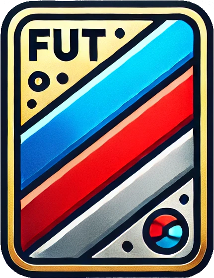

<p align="center">
  
</p>

<h1 align="center">Fut Card Generator</h1>
<p align="center">Generate custom Fut cards.</p>

<p align="center">
    
    
    
</p>

## Description

Fut Card Generator is a command line tool and library to generate custom Fut cards.

## Installation

### From source

Clone the repository and update the submodules:

```bash
git clone https://github.com/eoussama/fut-card-generator.git
cd fut-card-generator
git submodule update --init --recursive
```

Build the project:

```bash
mkdir build
cd build
cmake ..
```

### From binary

Download the latest release from the [releases page](https://github.com/eoussama/fut-card-generator/releases).

## Usage

```bash
fut-card-generator --help
```

### Options

The following are the options available

| Option | Abbreviation | Default | Description |
| --- | --- | --- | --- |
| `--help` | -h | | Show help message |
| `--version` | -v | | Show version |
| `--name` | -n | | Player name |
| `--out` | -o | | Output file path |
| `--show` | -s | | Flag whether to preview the card after generation | |
| `--logo` | -l | | Path to the logo of the player | |
| `--image` | -i | | Path to the image of the player | |
| `--translation` | -t | | Transaltion of the text on the card | |
| `--edition` | -e | | Code for the edition of the fut card to generate | |
| `--kind` | -k | | Code for the template of the card to generate | |
| `--country` | -c | | Country code of the player | |
| `--position` | -p | | Position of the player on the card | |
| `--pace` | -pac | | Pace of the player on the card | |
| `--passing` | -pas | | Passing of the player on the card | |
| `--physical` | -phy | | Physical of the player on the card | |
| `--shooting` | -sho | | Skill of the player on the card | |
| `--dribbling` | -dri | | Dribbling of the player on the card | |
| `--defending` | -def | | Defense of the player on the card | |

#### Translations

| Code | Language |
| --- | --- |
| en | English |
| fr | French |
| es | Spanish |
| pt | Portuguese |
| it | Italian |
| de | German |

#### Editions

| Code | Edition |
| --- | --- |
| fifa19 | FIFA 19 |

#### Positions

| Code | Position |
| --- | --- |
| gk | Goalkeeper |
| lb | Left Back |
| lwb | Left Wing Back |
| cb | Centre Back |
| rb | Right Back |
| rwb | Right Wing Back |
| lm | Left Midfield |
| cdm | Centre Midfield |
| cm | Centre Midfield |
| cam | Centre Midfield |
| rm | Right Midfield |
| lw | Left Wing |
| rw | Right Wing |
| lf | Left Full Back |
| cf | Centre Full Back |
| rf | Right Full Back |
| st | Striker |
| all | All |

#### Kinds

| Code | Kind |
| --- | --- |
| common_bronze | Common Bronze |
| common_silver | Common Silver |
| common_gold | Common Gold |
| rare_bronze | Rare Bronze |
| rare_silver | Rare Silver |
| rare_gold | Rare Gold |
| if_bronze | IF Bronze |
| if_silver | IF Silver |
| if_gold | IF Gold |
| fc_bronze | FC Bronze |
| fc_silver | FC Silver |
| fc_gold | FC Gold |
| motm | MOTM |
| pl_potm | PL POTM |
| bl_potm | BL POTM |
| futties | Futties |
| futtiesw | FuttiesW |
| toty | Toty |
| toty_n | Toty N |
| el | EL |
| el_motm | EL MOTM |
| el_live | EL Live |
| el_sbc | EL SBC |
| el_tott | EL Tott |
| common_ucl | Common UCL |
| rare_ucl | Rare UCL |
| ucl_motm | UCL MOTM |
| ucl_live | UCL Live |
| ucl_sbc | UCL SBC |
| ucl_tott | UCL Tott |
| fsr | FSR |
| fs | FS |
| fsn | FSN |
| pp | PP |
| cb | CB |
| rb | RB |
| hero | Hero |
| aw | AW |
| fb | FB |
| headliners | Headliners |
| cc | CC |
| sbc | SBC |
| sbcp | SBCP |
| legend | Legend |

#### Country Codes

Check out [countries.json](./assets/nations/countries.json) for a list of all the country codes.

> Note: All parameters should be lowercase, that goes especially for the country codes.

## License

This project is licensed under the MIT License - see the [LICENSE](LICENSE) file for details.